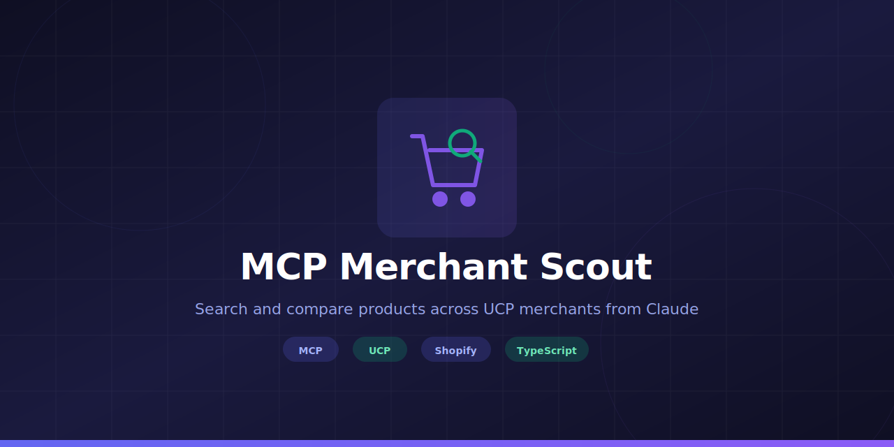

<p align="center">
  
</p>

<p align="center">
  <a href="https://opensource.org/licenses/MIT"></a>
  <a href="https://www.typescriptlang.org/"></a>
  <a href="https://modelcontextprotocol.io"></a>
  <a href="https://ucp.dev"></a>
</p>

<p align="center">
  An MCP server that wraps the <a href="https://ucp.dev">Universal Commerce Protocol (UCP)</a> Discovery and Catalog capabilities, letting you search and compare products across UCP merchants directly from Claude.
</p>

---

## Tools

| Tool | Description |
|------|-------------|
| `discover_merchant` | Fetch a merchant's `/.well-known/ucp` profile and register it |
| `search_products` | Search for products across all discovered merchants (query is optional, supports price filters) |
| `get_product` | Get full details for a specific product |
| `compare_products` | Compare 2-5 products side-by-side |

## Setup

```bash
git clone https://github.com/davillafer/mcp-merchant-scout.git
cd mcp-merchant-scout
npm install
npm run build
```

### Claude Code

Create a `.mcp.json` file in your project directory:

```json
{
  "mcpServers": {
    "ucp-merchant-scout": {
      "command": "node",
      "args": ["/absolute/path/to/mcp-merchant-scout/dist/index.js"]
    }
  }
}
```

### Claude Desktop

Add to `~/Library/Application Support/Claude/claude_desktop_config.json`:

```json
{
  "mcpServers": {
    "ucp-merchant-scout": {
      "command": "node",
      "args": ["/absolute/path/to/mcp-merchant-scout/dist/index.js"]
    }
  }
}
```

## Usage

Once configured, use natural language in Claude:

1. **Discover a merchant**: "Discover the merchant at https://puddingheroes.com"
2. **Search products**: "Search for products under $20"
3. **Search with keywords**: "Find me a sci-fi book"
4. **Get details**: "Get details on pudding-heroes-paperback"
5. **Compare**: "Compare these two products side by side"

## UCP Spec Compatibility

Supports both the **official UCP spec (2026-01-23)** and legacy implementations:

| Feature | Spec support | Legacy fallback |
|---------|-------------|-----------------|
| Discovery | `/.well-known/ucp` | `/api/ucp/discovery` |
| Services | Reverse-domain keyed with transport bindings | Flat string paths |
| Capabilities | Reverse-domain keyed objects | Flat string arrays |
| Payment handlers | `ucp.payment_handlers` (keyed object) | `payment.handlers` (array) |
| Catalog search | `POST /catalog/search` | `GET /products` |
| Product lookup | `POST /catalog/lookup` | `GET /products/:id` |
| UCP-Agent header | `profile="<discovery-url>"` (spec format) | |

The client tries spec-compliant endpoints first and falls back to legacy formats automatically.

## Live UCP Merchants

| Endpoint | Format | Description |
|----------|--------|-------------|
| `https://puddingheroes.com` | Legacy | Public sandbox with 10 products (books, rentals, memberships) |
| `https://ucp-demo-api.hemanthhm.workers.dev` | Spec | Community demo with 5 AI gadget products |

## Development

```bash
npm run dev    # Run with tsx (auto-reload)
npm run build  # Compile TypeScript
npm start      # Run compiled output
```

## Architecture

```
Claude <--stdio--> MCP Server <--HTTP--> Merchant A (/.well-known/ucp -> /catalog/search)
                               <--HTTP--> Merchant B (/.well-known/ucp -> /products)
```

The server maintains an in-memory registry of discovered merchants. Product searches fan out to all registered merchants in parallel using `Promise.allSettled()`.

## Tech Stack

- TypeScript
- [@modelcontextprotocol/sdk](https://github.com/modelcontextprotocol/typescript-sdk) - MCP server framework
- [zod](https://github.com/colinhacks/zod) - Schema validation
- [UCP](https://ucp.dev) (Universal Commerce Protocol) - Open commerce standard
